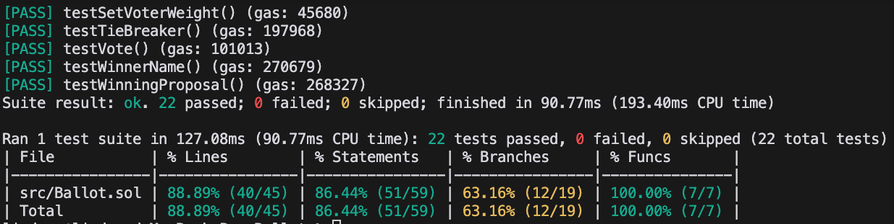

# 投票智能合约

本项目使用 Solidity 和 Foundry 实现了一个用于投票目的的智能合约。

## 项目结构

- `src/Ballot.sol`: 主要的投票智能合约
- `test/BallotTest.sol`: 投票合约的测试文件

## 安装

要安装项目依赖，请运行：

```shell
make install
```

## 测试

运行测试：

```shell
make test
```

测试覆盖率：

